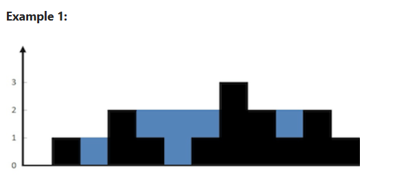

```cpp
class Solution {
public:
    int trap(vector<int>& height) {
        int n = height.size();
        int leftmax = 0;
        int rightmax = 0;
        int water = 0;
        int left = 0;
        int right= n-1;

        while (left < right) {

    // We move the side which has the smaller height,
    // because water level depends on the smaller boundary
    if (height[left] < height[right]) {

        // Update the maximum height seen so far from the left side
        // This represents the tallest wall on the left
        leftmax = max(leftmax, height[left]);

        // Water trapped at this index =
        // tallest left wall - current height
        // (if negative, max() above prevents it)
        water += leftmax - height[left];

        // Move left pointer inward after processing this bar
        left++;

    } else {

        // Update the maximum height seen so far from the right side
        // This represents the tallest wall on the right
        rightmax = max(rightmax, height[right]);

        // Water trapped at this index =
        // tallest right wall - current height
        water += rightmax - height[right];

        // Move right pointer inward after processing this bar
        right--;
    }
}

        return water;
    }
};
```