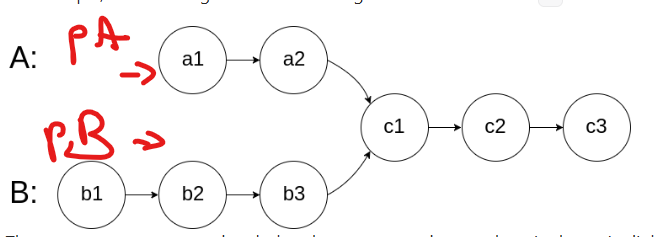

Given the heads of two singly linked-lists headA and headB, return the node at which the two lists intersect. If the two linked lists have no intersection at all, return null.


```cpp
class Solution {
public:
    ListNode *getIntersectionNode(ListNode *headA, ListNode *headB) {
        if (!headA || !headB) return nullptr;

        ListNode* pA = headA;
        ListNode* pB = headB;

        while (pA != pB) {
            pA = (pA == nullptr) ? headB : pA->next;
            pB = (pB == nullptr) ? headA : pB->next;
        }

        return pA;   // either intersection node OR nullptr
    }
};
```