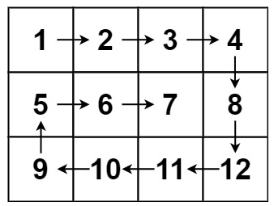

Given an m x n matrix, return all elements of the matrix in spiral order.



```cpp
class Solution {
public:
    vector<int> spiralOrder(vector<vector<int>>& matrix) {
        int m = matrix.size();
        int n = matrix[0].size();
        int top = 0;
        int bot = m-1;
        int left = 0;
        int right = n-1;
        std::vector<int> res;

        while(top<=bot && left<=right){
            // Left -> right
            for (int col=left; col<=right; col++){
                res.push_back(matrix[top][col]);
            }
            top++;
            // Top -> bottom
            for(int row=top; row<=bot; row++){
                res.push_back(matrix[row][right]);
            }
            right--;
            // right->left
            if(top<=bot){
                for(int col=right; col>=left; col--){
                    res.push_back(matrix[bot][col]);
                }
                bot--;
            }
            // bot -> top
            if(left<=right){
                for(int row=bot; row>=top; row--){
                    res.push_back(matrix[row][left]);
                }
                left++;
            }
        }
        return res;

    }
};
```