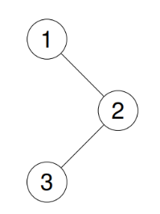

Input: root = [1,null,2,3]

Output: [1,3,2]


```cpp
class Solution {
public:
    
    void inorder(TreeNode* root,vector<int>& result){
        if(root==NULL) return;
        inorder(root->left, result);
        result.push_back(root->val);
        inorder(root->right, result);
    }
    vector<int> inorderTraversal(TreeNode* root) {
        vector<int> result;
        inorder(root, result);
        return result;
        
    }
};
```