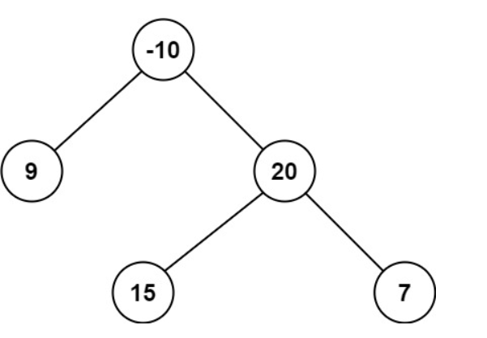

A path in a binary tree is a sequence of nodes where each pair of adjacent nodes in the sequence has an edge connecting them. A node can only appear in the sequence at most once. Note that the path does not need to pass through the root.

The path sum of a path is the sum of the node's values in the path.

Given the root of a binary tree, return the maximum path sum of any non-empty path.


```cpp
class Solution {
public:
    int maxSum = INT_MIN;

    int dfs(TreeNode* root) {
        if (!root) return 0;

        int left = max(0, dfs(root->left));
        int right = max(0, dfs(root->right));

        // Path passing through this node
        maxSum = max(maxSum, left + right + root->val);

        // Return one-side path to parent
        return root->val + max(left, right);
    }

    int maxPathSum(TreeNode* root) {
        dfs(root);
        return maxSum;
    }
};
```