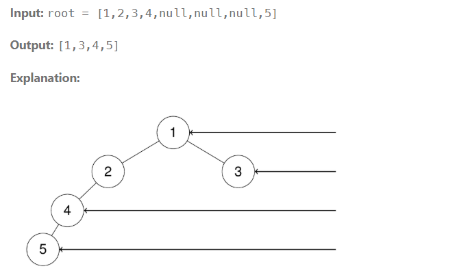

Given the root of a binary tree, imagine yourself standing on the right side of it, return the values of the nodes you can see ordered from top to bottom.



```cpp
class Solution {
public:
    vector<int> result;

    void dfs(TreeNode* root, int depth) {
        if (!root) return;

        // first node at this depth
        if (depth == result.size()) {
            result.push_back(root->val);
        }
        // go right first
        dfs(root->right, depth + 1);
        dfs(root->left, depth + 1);
    }

    vector<int> rightSideView(TreeNode* root) {
        dfs(root, 0);
        return result;
    }
};
```