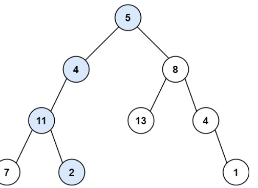

Given the root of a binary tree and an integer targetSum, return true if the tree has a root-to-leaf path such that adding up all the values along the path equals targetSum.

A leaf is a node with no children.




```cpp
class Solution {
public:
    bool hasPathSum(TreeNode* root, int targetSum) {
        if (!root) return false;

        if (root->left == nullptr && root->right == nullptr) {
            return targetSum == root->val;
        }

        int rem = targetSum - root->val;
        return hasPathSum(root->left, rem) || hasPathSum(root->right, rem);
    }
};
```
